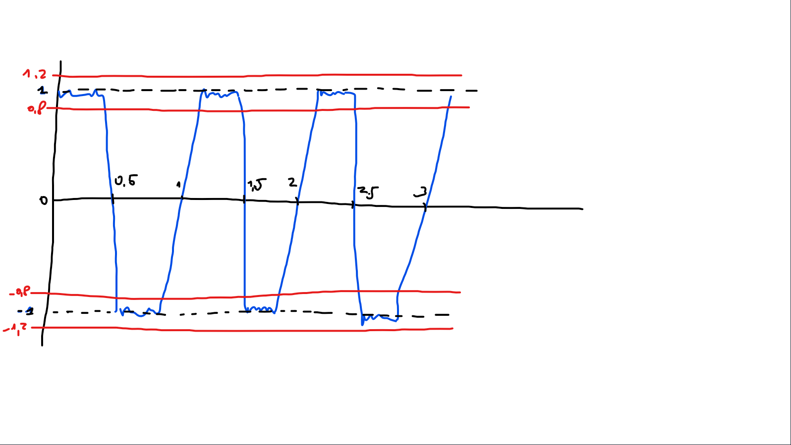
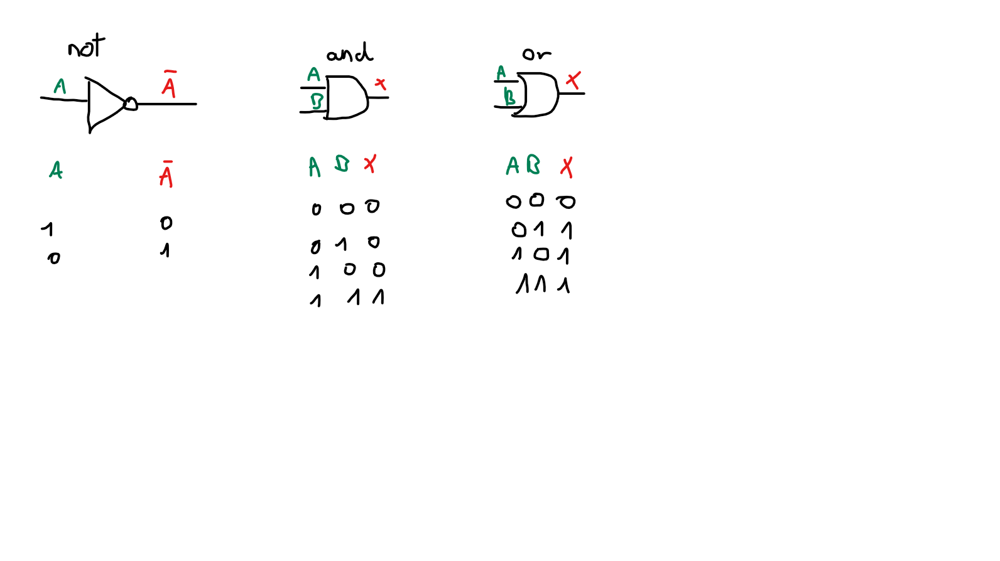

## Ditigaal en analoge signalen.
Een analoog signaal bevat ruis. Het is dus niet mogelijk om dit precies af te lezen en om hiermee informatie over te brengen, tenzij je een extreem geïsoleerd systeem hebt. Daarom maken computers gebruik van een digitaal signaal. Dit is eigenlijk ook een analoog signaal (blauw), dat wordt afgelezen met afwijkingsmarge (rood).

Op deze manier wordt ruis uitgesloten. Daar tegenover staat dan wel dat je met een aanname zit, en niet met een exact waarde. Daarom wordt er met `1` en `0`, of `true` en `false` gewerkt. Door alles te vernauwen tot een binair stelsel, valt twijfel over een waarde gemakkelijk uit te sluiten. Wanneer een waarde zich tussen `0,8` en `1,2` bevindt, is ze `1` of `true` (of andere termen), en wanneer een waarde zich tussen `-0,8` en `-1,2` bevindt, is ze `0` of `false` (of andere termen).

## Logic gates
Een logic gate neemt input waarden die enkel `0` (`false`) of `1` (`true`) kunnen zijn. Daarna geeft het een output die bepaald kan worden op basis van een paar regels. De basis van alle binaire logica is opgebouwd uit de volgende drie logic gates.

