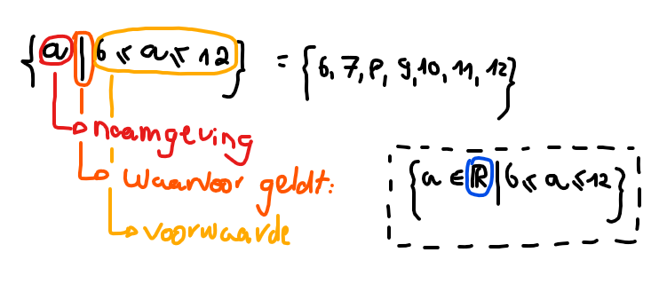
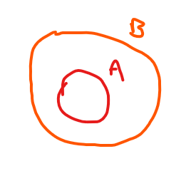
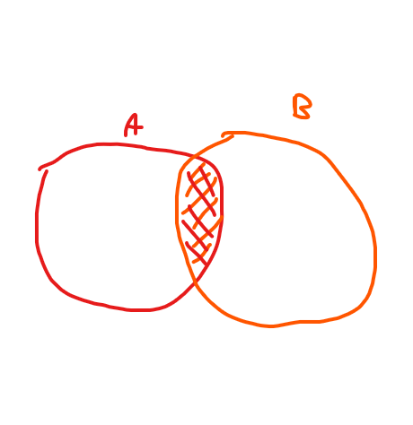
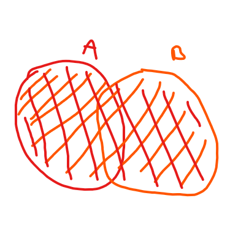
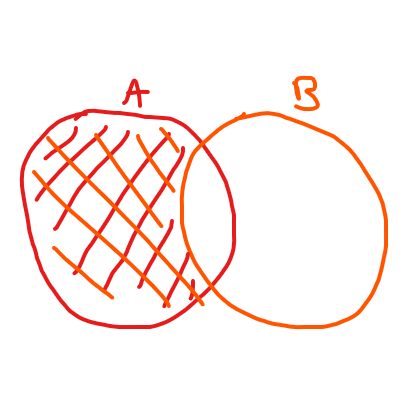
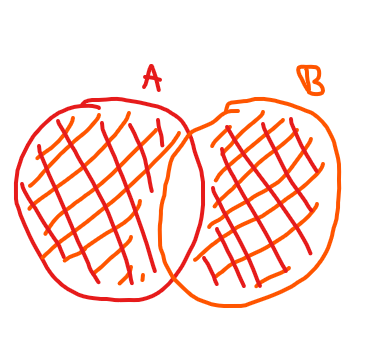
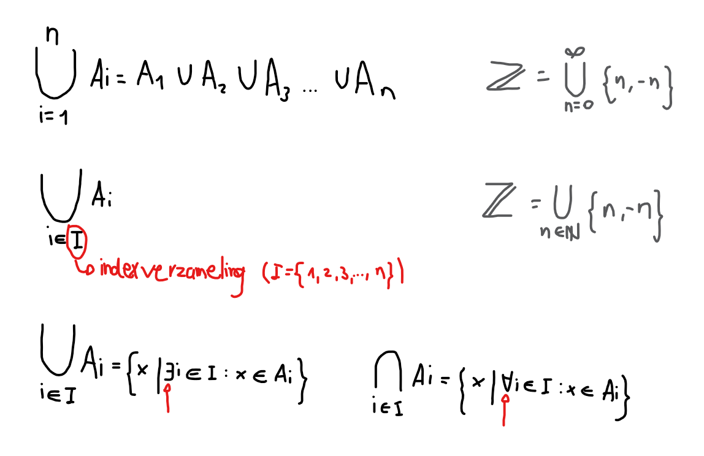
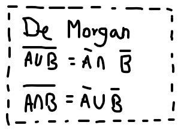
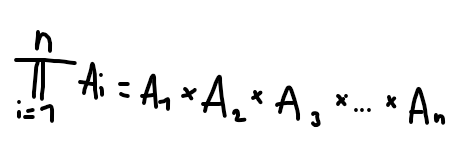

## Verzamelingen
ℕ = Natuurlijke getallen (Enkel positieve gehele getallen -> geen breuken)  
ℤ = Gehele getallen (Positieve en negatieve gehele gettalen -> geen breuken)  
ℚ = Rationale getallen (Alle gehele getallen en breuken)  
ℝ = Reeële getallen  

Een verzemling is een geheel van objecten die om een gemeenschappelijke reden bij elkaar zitten.
{kat, hond, vis} => (opsomming)
{natuurlijke getallen} => (beschrijving)
Een verzameling bevat enkel unieke objecten, geen duplicaten.
A = {3/4, 6/8, 9/12} = {3/4}

### Verzameling theoretische schrijfwijze

In het met stippels omkaderde stuk vind je dezelfde verzameling opnieuw. Enkel is er hier (blauw omcirkelt) een voorwaarde gegeve aan `a` nog voor de uiteindelijke echte voorwaarden. Dit beschrijft enkel dat deze verzameling zich in (in dit geval) in de reeële getallen bevindt. Je hoeft dit niet te schrijven. Dan wordt er vanuit gegaan dat het over de reeële gettalen gaat. Als je je verzameling tot een andere verzameling wilt beperken, moet je die hier wel aangeven.

### Voorbeeld: schrijvwijzes van gehele veelvouden van 3
= {..., -6, -3, 0, 3, 6, ...}
= {3n | n ∈ ℤ}
= {q | ∃ n ∈ ℤ zodat q = 3n}
= {a | a/3 ∈ ℤ}
= {a ∈ ℤ | a (mod 3) = 0}

> [!NOTE]
> **Mod - Modulo**   
> 14 (mod 6) = 2  
> Hierbij is 2 de rest van 14   
> bij een deling door 6.    

> [!NOTE]
> **Symbolen**    
> ∀ voor all    
> ∃ er bestaat    
> ∃! er bestaat slechts één  

### Deelverzameling
A ⊂ B ⇔ ∀ a ∈ A: a ∈ B

### Doorsnede
A ⋂ B = {x | x ∈ A en x ∈ B}  
ℤ ⋂ ℝ+ = ℕ

### Unie
A ⋃ B = {x | x ∈ A of x ∈ B}

### Verschil
A \ B = {x | x ∈ A en x ∉ B}  
B \ A = {x | x ∈ B en x ∉ A}

### Symmetrisch verschil (wordt bijna niet gebruikt)
A ∆ B = {X | x ∈ A: x ∉ B en x ∈ B: x ∉ A} _controleer dit_  
A ∆ B = (A \ B) ⋃ (B \ A)  
A ∆ B = (A ⋃ B) \ (A ⋂ B)

### Eigenschappen
**Commutativiteit**  
A ⊂ B ≠ B ⊂ A  
A ⋂ B = B ⋂ A  
A ⋃ B = B ⋃ A  
A \ B ≠ B \ A  
A ∆ B = B ∆ A  

**Associativiteit**  
(A ⊂ B) ⊂ C ≠ A ⊂ (B ⊂ C)  
(A ⋂ B) ⋂ C = A ⋂ (B ⋂ C) = A ⋂ B ⋂ C  
(A ⋃ B) ⋃ C = A ⋃ (B ⋃ C) = A ⋃ B ⋃ C  
(A \ B) \ C ≠ A \ (B \ C)  
(A ∆ B) ∆ C = A ∆ (B ∆ C) = A ∆ B ∆ C  

**Distributiviteit**  
A ⋂ (B ⋃ C) = (A ⋃ B) ⋂ (A ⋃ C)  
A ⋃ (B ⋂ C) = (A ⋂ B) ⋃ (A ⋂ C)  

### Unie/doorsnede van veel verzamelingen

### Terminologie
{0}                           => __singleton__ (verzameling met 1 element)  
{0} = {} = ∅                  => __nulverzameling__, __lege verzameling__  
A ⋂ B = ∅                     => A en B zijn __disjunct__  
**"universum"** = Ω = V = U       => verzameling waarbinnen je werkt  
Ω \ A = Ᾱ = **complement** van A  => Ᾱ en A complementeren elkaar en maken samen Ω  

∀ A: ∅ ∈ A  
A ⋃ Ω = Ω  
A ⋃ ∅ = A  
A ⋂ Ω = A  
A ⋂ ∅ = ∅  
Ω- = ∅  
∅- = Ω

### Machtsverzameling
2A => een verzameling van alle deelverzamelingen van A

A = {k, h, v} **3 elements**  
2A = {∅, {k}, {h}, {v}, {k, h}, {k, v}, {h, v}, A} **8 elementen (23 = 8)**

Een matchsverzameling heeft __altijd__ 2 als grondtal.

### Carthesisch Product
A × B = {(a, b) | a ∈ A, b ∈ B}  
A = {1, 2}  
B = {k, h}  
A × B = {(1, k), (1, h), (2, k), (2, h)}  
A × B × C = {(a, b, c) | a ∈ A, b ∈ B, c ∈ C}  

ℝ2 = ℝ × ℝ = {(x, y) | a, y ∈ ℝ}                     => (Alle punten in het vlak)

De hoofdletter π functioneert op een gelijkaardige manier als het sommatie teken (∑). In plaats van een optelling, voer je hier een vermenigvuldiging uit. Het resultaat van een carthesisch product is een verzameling van n tupels. Een tupel is een paar zoals (a, b) of een triplet zoals (a, b, c).
